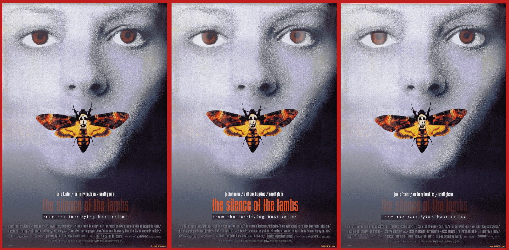

# 🦋  The-Silence-of-the-Lambs-Poster 2019
Animated Poster with Adobe Animate (HTML Canvas) / Afiche animado!

---

### 🔍 Descripción
Este proyecto transforma la imagen estática del póster en una pieza animada. 

### 🪲 Características
* **Movimiento orgánico:** Animación de las alas y antenas de la mariposa para un efecto natural.
* **Efectos visuales:** Juego de luces y brillos que recorren el diseño para mayor profundidad.
* **Tecnología:** Desarrollado con **Adobe Animate** y exportado como **HTML5 Canvas**.

### 🛠️ Herramientas
* **Adobe Animate** (para la línea de tiempo e interpolaciones).
* **JavaScript / CreateJS** (para la ejecución en navegador).
* **HTML5** (para el renderizado).

---

---------
Probando GITHUB ---- primer repo / proyecto -- (estas última líneas del README las dejo por nostalgia)

 
